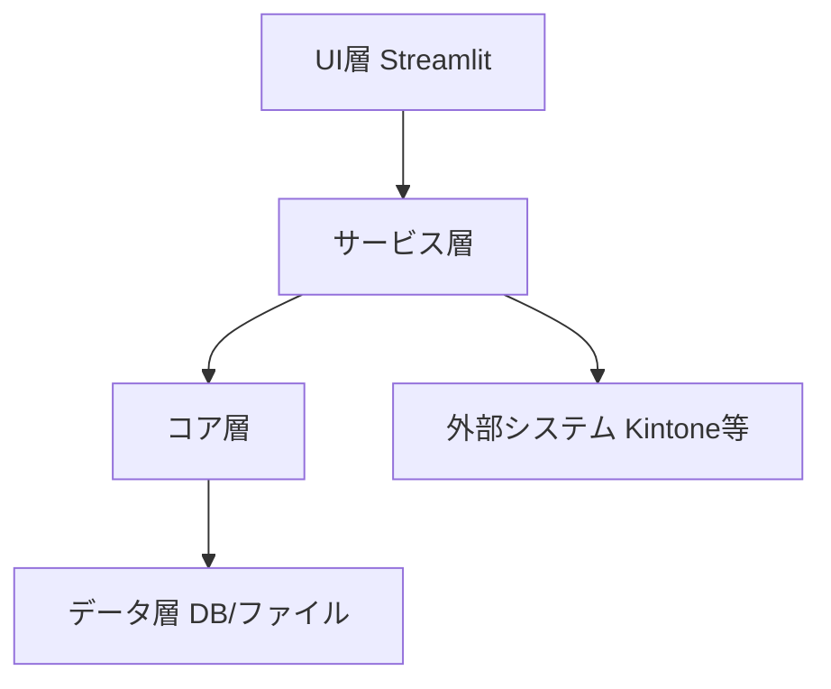

# システムパターン

本ドキュメントでは、「遺産整理・遺言書作成支援アプリ」における主要なシステムパターンとアーキテクチャの指針を記述します。

## 1. モジュール構成

アプリケーションは、以下の主要なモジュールに分割されます。

*   **UI層 (`src/legal_system/ui/`)**: Streamlitを使用したユーザーインターフェース。各種ページやコンポーネントが含まれます。
*   **サービス層 (`src/services/`)**: ビジネスロジックをカプセル化し、UI層に機能を提供します。データの永続化、外部システム連携、複雑な計算などを担当します。
*   **コア層 (`src/legal_system/core/`)**: 共通のユーティリティ、設定、AI処理、データベース管理など、アプリケーションの中核となる機能を提供します。
*   **データ層**: データベース（SQL、ChromaDB）、ファイルシステムなど、データの永続化と取得を担当します。

## 2. データフロー

ユーザー入力はUI層で受け付けられ、サービス層を介してビジネスロジックが実行されます。必要に応じてコア層の機能（AI処理、データベースアクセス）が利用され、データ層との間でデータの読み書きが行われます。

## 3. データベース戦略

*   **リレーショナルデータベース (SQL)**: 案件情報、相続人情報、財産情報など、構造化された主要データの永続化に使用します。
    *   Alembicを用いたマイグレーション管理。
*   **ベクトルデータベース (ChromaDB)**: RAG (Retrieval Augmented Generation) のためのドキュメント埋め込み、セマンティック検索に利用します。特に、OCRで読み取られた非構造化データや法的文書の管理に有効です。

## 4. AI/LLM連携

*   **RAG (Retrieval Augmented Generation)**: 法的文書やFAQなどの知識ベースから関連情報を取得し、LLMの回答精度を向上させます。
    *   ChromaDBに法的文書の埋め込みを保存。
*   **OCR連携**: 帳票からのデータ抽出、手書き文字認識など。
*   **自然言語処理**: 質問応答、要約、情報抽出。

## 5. 外部システム連携

*   **Kintone**: 既存のKintoneアプリケーションとのデータ連携、顧客情報の同期など。

## 6. ドキュメント生成

*   **テンプレートベースのドキュメント生成**: 遺言書ドラフト、相続関係説明図、財産目録などは、テンプレートと入力データに基づいて生成されます。

## 7. エラーハンドリングとロギング

*   アプリケーション全体で一貫したエラーハンドリングとロギング戦略を導入し、問題の特定とデバッグを容易にします。

## 8. セキュリティ

*   機密データの暗号化（既存の `src/services/encryption_service.py` を活用）。
*   認証・認可メカニズム（要検討）。
*   入力値検証による脆弱性対策。

## 9. 業務ワークフローのシステム定義
本システムでは、遺産承継および遺言書作成に関する業務フローを以下のテーブル形式で管理・実行します。各フェーズIDはシステム内部で一意に管理される識別子です。

### 9.1. 遺産整理業務ワークフロー

| フェーズID | タスク名 | トリガー | 依存関係 | 担当ロール | 期限の目安 |
| :--------- | :----------------------------- | :----------------------------------- | :----------------------------------- | :----------- | :------------- |
| LE_010     | 依頼者面談・ヒアリング         | 案件新規作成                         | なし                                 | 行政書士     | 着手から3日以内 |
| LE_020     | 戸籍等収集指示                 | LE_010 完了                          | LE_010                               | 行政書士     | 着手から3日以内 |
| LE_030     | 戸籍等収集・OCR入力            | LE_020 完了                          | LE_020                               | 事務員       | 着手から14日以内 |
| LE_040     | 相続関係図作成・確認           | LE_030 完了                          | LE_030                               | 行政書士     | 着手から3日以内 |
| LE_050     | 財産調査方針決定               | LE_040 完了                          | LE_040                               | 行政書士     | 着手から3日以内 |
| LE_060     | 財産調査（金融機関、不動産等）   | LE_050 完了                          | LE_050                               | 事務員       | 着手から30日以内 |
| LE_070     | 基礎控除額判定・ルート分岐       | LE_060 完了                          | LE_060                               | 行政書士     | 着手から7日以内 |
| LE_080_B   | (ルートB) 税理士連携・財産評価 | LE_070 完了 (ルートB)                | LE_070                               | 行政書士/税理士 | 着手から14日以内 |
| LE_090_B   | (ルートB) 財産目録・遺産分割協議書作成 | LE_080_B 完了                          | LE_080_B                             | 税理士       | 着手から30日以内 |
| LE_080_C   | (ルートC) 財産目録作成         | LE_070 完了 (ルートC)                | LE_070                               | 行政書士     | 着手から14日以内 |
| LE_090_C   | (ルートC) 遺産分割協議書作成   | LE_080_C 完了                          | LE_080_C                             | 行政書士     | 着手から14日以内 |
| LE_100     | 遺産分割協議の調整             | LE_090_B または LE_090_C 完了      | LE_090_B, LE_090_C                   | 行政書士     | 着手から30日以内 |
| LE_110     | 名義変更・解約手続き支援       | LE_100 完了                          | LE_100                               | 事務員       | 着手から60日以内 |
| LE_120     | 業務完了報告                   | LE_110 完了                          | LE_110                               | 行政書士     | 着手から7日以内 |

### 9.2. 遺言書作成業務ワークフロー

| フェーズID | タスク名 | トリガー | 依存関係 | 担当ロール | 期限の目安 |
| :--------- | :------------------- | :------------------- | :------------------- | :----------- | :------------- |
| WI_010     | 依頼者面談・意向確認 | 遺言作成案件新規作成 | なし                 | 行政書士     | 着手から3日以内 |
| WI_020     | 財産・相続人情報収集 | WI_010 完了          | WI_010               | 事務員       | 着手から14日以内 |
| WI_030     | 遺言書案文作成       | WI_020 完了          | WI_020               | 行政書士     | 着手から14日以内 |
| WI_040     | 依頼者確認・修正     | WI_030 完了          | WI_030               | 行政書士     | 着手から7日以内 |
| WI_050     | 公証役場との調整     | WI_040 完了          | WI_040               | 事務員       | 着手から7日以内 |
| WI_060     | 公正証書遺言作成完了 | WI_050 完了          | WI_050               | 行政書士     | 着手から7日以内 |

## 10. RAG（過去データ参照）の連携ルール
AIが各タスク実行時に参照すべき過去ドキュメントの種類と、レコメンド内容、検索キーワードを定義します。

| タスク名 | 参照すべき過去ドキュメントの種類 | AIによるレコメンド内容 | 検索キーワード |
| :----------------------------- | :----------------------------------- | :----------------------------------- | :----------------------------------- |
| 依頼者面談・ヒアリング         | 過去の面談記録、ヒアリングシート雛形 | 初回面談時の確認事項、遺言の有無、相続人の範囲、財産の種類、特に注意すべき人間関係。 | 「初回面談 ヒアリングシート」「相続人調査 質問事項」 |
| 戸籍等収集・OCR入力            | 過去の戸籍収集時の送付状、職務上請求書ひな形 | 戸籍の連続性確認、取得漏れの注意点、除籍・改製原戸籍の読み方、身分事項の確認。 | 「戸籍収集 送付状 ひな形」「職務上請求書 書き方」「戸籍 読み方 ポイント」 |
| 相続関係図作成・確認           | 過去の相続関係図、家系図作成事例   | 相続人の重複、代襲相続の発生有無、養子縁組の有無、相続欠格・廃除の確認。 | 「相続関係図 作成例」「家系図 テンプレート」「代襲相続 範囲」 |
| 財産調査（金融機関、不動産等）   | 過去の銀行解約書類の控え、不動産登記簿謄本サンプル、固定資産評価証明書 | 各金融機関の手続き、名義預金の有無、未登記不動産の有無、評価方法の注意点。 | 「〇〇銀行 解約 手続き」「不動産登記簿謄本 読み方」「名義預金 注意点」 |
| 財産目録・遺産分割協議書作成   | 過去の財産目録・遺産分割協議書雛形、評価証明書 | 財産の評価方法、評価額の記載、遺産分割の具体例、特別受益・寄与分の考慮。 | 「財産目録 記載例」「遺産分割協議書 テンプレート」「特別受益 寄与分」 |
| 遺言書案文作成                 | 過去の公正証書遺言・自筆証書遺言案文雛形、判例 | 遺言の法的要件、付言事項の記載例、遺留分減殺請求の可能性、配偶者居住権の考慮。 | 「公正証書遺言 案文 雛形」「自筆証書遺言 要件」「配偶者居住権 遺言」 |
| 公証役場との調整               | 過去の公証役場とのメール履歴、必要書類一覧 | 公証役場への事前連絡事項、必要書類、手数料、日程調整時の注意点。 | 「公証役場 連絡事項」「公正証書遺言 必要書類」「公証人 手数料」 |

## 11. AIによるチェック機能（漏れ検知）
AIは、以下のチェックリストと条件ロジックに基づき、業務の抜け漏れや記載ミスを自動検知し、ユーザーにアラートを提示します。

*   **相続登記の依頼時**:
    *   もし、登記簿上の住所と住民票の住所が一致しない場合、AIは「住居表示変更証明書」の取得が必須であることをアラートします。
    *   もし、不動産が共有名義の場合、AIは共有者全員の意思確認と署名捺印が必須であることをアラートします。

*   **銀行解約書類の作成時**:
    *   もし、相続人全員による手続きが必要な場合、AIは「相続人全員の署名・実印が確認できているか」、および「印鑑証明書の有効期限（発行から3ヶ月以内など）が有効であるか」を確認するようアラートします。
    *   もし、被相続人の口座に未整理の配当金や利息がある場合、AIは「未収金の確認と処理」を促します。

*   **遺産分割協議書作成時**:
    *   もし、遺産分割協議書に相続人全員の署名・実印がない場合、AIは不備をアラートします。
    *   もし、遺産分割協議書に記載された財産が財産目録と一致しない場合、AIは整合性の不一致をアラートします。
    *   もし、特定の相続人に特別受益や寄与分がある場合、AIはそれが遺産分割協議に適切に反映されているかを確認するよう促します。

*   **遺言書作成時**:
    *   もし、公正証書遺言の作成において証人が2名確保されていない場合、AIは要件不備をアラートします。
    *   もし、遺留分権利者が存在し、かつ遺言内容が遺留分を侵害する可能性がある場合、AIは「遺留分侵害額請求の可能性」について注意喚起します。
    *   もし、自筆証書遺言の場合、AIは「日付、署名、押印」の要件確認と、財産目録が添付されている場合は「各ページに署名・押印」がされているかを促します。

*   **戸籍謄本の内容確認時**:
    *   もし、取得した戸籍の連続性が確認できない（除籍・改製原戸籍の不足など）場合、AIは不足している戸籍の取得を促します。
    *   もし、代襲相続の発生条件が満たされているにもかかわらず、代襲相続人が相続関係図に反映されていない場合、AIは修正を促します。

## 12. 権限管理とUI制御
システムのUIは、案件の「税理士連携フラグ」および担当ユーザーの「ロール（行政書士、事務員、税理士）」に基づいて、特定の機能やボタンの表示・非表示、および操作可否を動的に制御します。
例えば、ルートB（税理士連携型）の案件では、財産目録や遺産分割協議書の作成ボタンは税理士ロールを持つユーザーのみが操作可能とし、行政書士や事務員からは非表示またはグレーアウト表示とします。
既存のコード（例: `src/services/automation/will_generator.py` や各種書類生成機能）は、この権限設定ロジックと連携して動作するよう設計方針を固める必要があります。