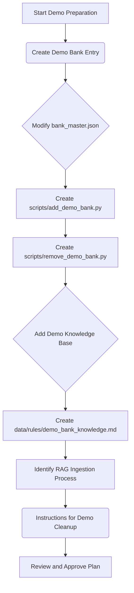

## 「銀行手続・ナレッジ検索」デモ準備計画

### 概要

「銀行手続・ナレッジ検索」機能のデモンストレーションを行うため、一時的な銀行情報と関連するナレッジベースを作成します。これにより、システムの動作を代表者に説明できる状態を目指します。

### フロー図

### Todoリスト

- [ ] Create a Python script [`scripts/add_demo_bank.py`](scripts/add_demo_bank.py) to add a temporary bank entry to [`bank_master.json`](bank_master.json).
- [ ] Create a Python script [`scripts/remove_demo_bank.py`](scripts/remove_demo_bank.py) to remove the temporary bank entry from [`bank_master.json`](bank_master.json).
- [ ] Create a Markdown file [`data/rules/demo_bank_knowledge.md`](data/rules/demo_bank_knowledge.md) containing demo procedure knowledge for the temporary bank.
- [ ] Identify the mechanism to ingest the [`data/rules/demo_bank_knowledge.md`](data/rules/demo_bank_knowledge.md) into the RAG system (e.g., `src/legal_system/utils/document_loaders.py` or a dedicated RAG ingestion script).
- [ ] Document the steps for running the demo and cleaning up the demo data.
