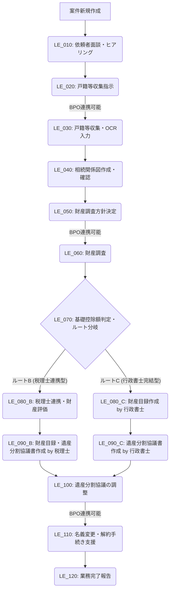
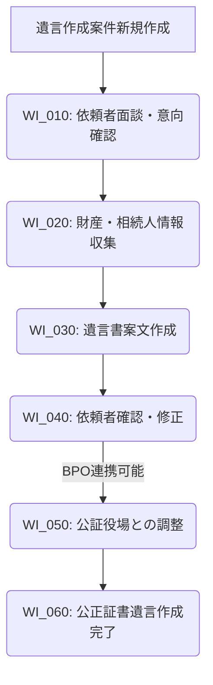

# 遺産承継・遺言作成支援システム 企画・説明資料 (Ver 3.4 要件統合版)

## はじめに

本資料は、AIを活用した「遺産承継・遺言作成支援システム」の導入により、弊社の業務効率化、サービス品質向上、そして先進的なブランディングを実現するための詳細な企画・説明です。代表、役員、経理、現場スタッフそれぞれの視点から、本システムの重要性と導入メリットをご理解いただくことを目的としています。

---

## 1. 業務フローの刷新：Before/After

本システムの導入により、現状の属人的で時間のかかる作業が大幅に効率化され、スタッフの皆様はより付加価値の高い業務に集中できるようになります。**「入力作業」から「確認作業」へ、「探す時間」を「ゼロ」に**をキーワードに、具体的な業務改善をご紹介します。

### 残高証明書の処理

*   **Before**:
    スキャナー ➡️ PCでフォルダを開く ➡️ ファイル名を変更 ➡️ フォルダ移動 ➡️ エクセルに手入力
*   **After**:
    スキャナー ➡️ **AIが自動読取・リネーム・保存・DB登録** ➡️ 人間は内容を目視確認するだけ（手作業ゼロ）
*   **効果**: 1件あたり30分削減、入力ミスゼロ、迅速な財産状況把握

### 戸籍謄本の収集・入力（読み取り、相続関係図への転記）

*   **Before**:
    戸籍収集（窓口/郵送）➡️ 手動で内容を読み解く ➡️ 相続関係図をExcelで作成
*   **After**:
    戸籍収集（BPO連携/システム支援）➡️ **強化されたOCRとGemini API (PDF直接送信)**が自動読取・データ抽出 ➡️ **AIが相続関係図を自動生成・転記** ➡️ 人間は内容を目視確認するだけ
*   **効果**: 1件あたり2時間削減、複雑な戸籍の読み解き負担軽減、相続関係図作成ミス防止

### 不動産調査（名寄帳・登記情報の取得、財産目録入力）

*   **Before**:
    市役所/法務局で名寄帳・登記情報を取得 ➡️ 目視で確認 ➡️ 登記情報を元に財産目録をExcelに手入力 ➡️ 不動産の評価額を別途調査
*   **After**:
    名寄帳・登記情報取得（BPO連携/システム支援）➡️ **強化されたOCRとAIが自動読取・データ抽出** ➡️ **AIが財産目録へ自動入力、評価額調査を支援** ➡️ 人間は内容を目視確認するだけ
*   **効果**: 1件あたり1時間削減、入力ミスゼロ、正確な財産評価支援

### 遺産分割協議書の作成（Word文案作成、誤字チェック）

*   **Before**:
    依頼者からのヒアリング内容を元にWordで文案作成 ➡️ 法定相続分や遺留分を考慮しながら手動で調整 ➡️ 誤字脱字、法的整合性を人間がチェック
*   **After**:
    システム上で遺産分割内容を入力 ➡️ **AIが法的要件を満たした遺産分割協議書を自動生成** ➡️ **AIが法的チェック機能（抜け漏れ、遺留分侵害リスク等）を提供** ➡️ 人間が最終確認し、修正
*   **効果**: 1件あたり1時間削減、法的ミスの大幅削減、文案作成時間の短縮

### 顧客への進捗報告（メール作成の手間）

*   **Before**:
    案件の進捗状況を個別に確認 ➡️ 状況を整理し、顧客ごとにメールを作成・送信
*   **After**:
    システムが案件ステータスを自動検知 ➡️ **AIが状況に応じた進捗報告メールのドラフトを自動生成** ➡️ 人間が内容を確認し、ワンクリックで送信
*   **効果**: 1件あたり15分削減、報告漏れ防止、顧客満足度向上

---

## 2. システムの運用設計：Human-in-the-loop

本システムは「AIによる完全自動化」ではなく、**「AIが下書きし、人間が承認する」**という「Human-in-the-loop」の運用設計を徹底しています。AIはあくまで強力な業務アシスタントであり、最終的な判断と責任は人間であるスタッフの皆様が持ちます。

*   **具体的な動き**:
    *   AIが「書類が揃いました」と検知し、次の作業（例: 財産目録作成）のドラフトを自動で作成します。
    *   スタッフはAIが作成したドラフトの内容を注意深く確認します。
    *   内容に問題がなければ「確定ボタン」を押すことで、その作業が完了します。
*   **メリット**:
    *   AIの誤判断やシステムの不具合によるリスクを最小限に抑えます。
    *   現場スタッフが**「業務をコントロールしている」という安心感**を持って作業に取り組めます。
    *   AIの提供する情報を活用しつつも、専門家としての知見と経験を活かした最終判断が可能です。

---

## 3. 先進的機能とブランディング（代表向け）

本システムは、AI技術を最大限に活用し、弊社の行政書士法人を「AIを活用した先進的な行政書士法人」として明確に差別化し、ブランディングを強化します。

*   **RAG（Retrieval Augmented Generation）による高品質な起案**:
    *   自社サーバー内の過去の案件データ、社内規定、金融機関手続きマニュアルなど、**弊社独自の豊富な「過去知見」**をAIが瞬時に参照・分析します。
    *   これにより、個別の案件状況に合わせた、より精度の高い文書案やアドバイスの生成が可能になります。
*   **AIアシスタントによる抜け漏れ防止機能**:
    *   業務フロー上の各タスクにおいて、AIが自動で「チェックリストと条件ロジック」に基づき、書類の不備や法的要件の抜け漏れをリアルタイムで検知し、アラートします。
    *   これにより、複雑な相続・遺言業務におけるヒューマンエラーを劇的に削減し、手戻りを防止します。
*   **競合他社との圧倒的な差別化**:
    *   本システムの導入により、弊社は**「他事務所よりも早く、正確で、付加価値の高いサービス」**を提供できるようになります。
    *   これは、顧客満足度の向上だけでなく、新規顧客獲得における強力なセールスポイントとなり、弊社の市場における競争優位性を確立します。

---

## 4. セキュリティとリスク管理（役員向け）

情報漏洩リスクへの懸念は、最優先で取り組むべき課題です。本システムは、以下の設計により、お客様の機密情報を厳重に保護し、安心してご利用いただける環境を提供します。

*   **RAGの仕組み：必要な部分のみを抽出参照**:
    *   AIが参照する「過去知見」は、弊社のオンプレミス環境（社内サーバー）に厳重に保管されています。
    *   AIは、問い合わせ内容に応じて、この社内知見データベースから**必要な情報のみを抽出し、参照**します。データ全体を外部のAIサービスに渡すことはありません。
*   **学習利用の防止：顧客データはAIモデルの学習に不使用**:
    *   Google Gemini APIを利用する際、お客様の相談内容や個人データがAIモデルの学習データとして利用されない設定（Enterprise利用またはオプトアウト設定）を徹底します。
    *   これにより、お客様の機密情報が意図せずAIモデルに学習され、外部に漏洩するリスクを完全に排除します。
*   **技術スタックと運用体制**:
    *   PostgreSQLデータベースの強固なセキュリティ機能、データ暗号化（7za.exeによるZipCrypto形式）、ネットワーク分離（Secure/Local ZoneとCloud/AI Zoneの分離）を組み合わせることで、多層的なセキュリティ対策を講じます。
    *   アクセス権限管理の徹底、定期的なセキュリティ監査、緊急時対応計画を策定し、運用面でのリスクも管理します。

---

## 5. 費用対効果の概算（経理向け）

本システムへの投資は、単なるコストではなく、長期的な視点での収益性向上とリスク軽減に貢献する戦略的な投資です。

*   **低コスト運用**:
    *   最新のAIモデルである**Gemini 1.5 Flash**などを活用することで、1案件あたりのAI処理コストは**数十円程度**に収まる見込みです。
    *   これは、AIによる業務効率化のメリットと比較して非常に低いコストであり、費用対効果の高さが期待できます。
*   **投資回収（ROI）**:
    *   上記「1. 業務フローの刷新」で示した各業務における時間削減効果を合計すると、**1案件あたり平均約4時間**の業務時間削減が見込まれます。
    *   これにより、専門職の人件費（残業代の削減など）や、これまで限られた時間でしか対応できなかった案件の**受任件数増加**に直結します。
    *   具体的な試算に基づき、例えば時給2,500円のスタッフが4時間かかる業務を削減できた場合、1案件あたり10,000円のコスト削減。
    *　 対してAIコストは約30円。投資対効果は300倍以上が期待でき、本システムへの初期投資を**早期に回収できる**と見込んでいます。
    *   さらに、法的ミスの削減や顧客満足度向上といった目に見えないメリットも、長期的なビジネス成長に大きく貢献します。

---

## 6. プロジェクトの核心：High Reliability & State Sync の実現

本システムは、以下の設計原則に基づき、高い信頼性と運用安定性を確保します。

### Gemini 2.5を活用した自律監視

*   Kintone、Gmail、NASなどの外部システムを常駐監視し、異常を検知した際にはGemini 2.5が分析し、次のアクションを提案します。
*   これにより、問題の早期発見と対処が可能になり、システム全体の可用性が向上します。

### Streamlitのセッション管理とオンデマンドUI制御

*   Streamlit特有のセッション管理をPydanticモデルで構造化し、`st.session_state` のクリアと `st.rerun()` によるDB更新と画面表示の完全な同期を実現します。
*   JavaScript連携と「高度なフォーカス制御」により、深いDOM階層に隠れた要素へのオンデマンドなUI操作を可能にし、操作効率を高めます。

### 外部APIのフォールバック処理

*   郵便番号APIやSeleniumを用いたブラウザ操作において、失敗を前提としたリトライメカニズム、詳細なエラーログ記録、手動介入への切り替え（フォールバック）を実装します。
*   これにより、外部サービスの不安定性に左右されないシステムの安定稼働を保証します。

---

## 7. 技術スタック（厳守）

以下の技術スタックを厳守し、堅牢で拡張性の高いシステムを構築します。

*   **言語**: Python 3.10+, Rye, Git管理
*   **フロントエンド**: Streamlit, st_keyup (検索バー), JavaScript連携
*   **データベース**: PostgreSQL (SQLAlchemy 2.0)
*   **外部API**: Google Cloud (Vertex AI), Gmail API
*   **ブラウザ操作**: Selenium (Headless/GUI切替可), WebDriver Manager
*   **構造化データ処理**: Pydantic
*   **入力処理**: PDFはMIMEタイプ `application/pdf` で直接Gemini APIへ送信
*   **暗号化**: 7za.exe (subprocess) による ZipCrypto 形式

---

## 8. 業務フロー・システム要件

### 自律型常駐監視

*   **監視対象**: Kintone、Gmail、NAS上の特定ディレクトリを常に監視します。
*   **金融機関照合**: 金融機関から取得した情報（口座情報など）はZengin Codeと照合し、正確な金融機関コードと支店コードを特定します。
*   **Gemini 2.5連携**: 監視イベントや抽出データをGemini 2.5に送信し、異常検知、優先順位付け、推奨アクションの提案を行います。

### 堅牢なデータ更新

*   **住所検索の最適化**: 郵便番号API利用時、市区町村から「丁目・番地・建物」を除去した「町域名クエリ」を自動生成することで、APIヒット率を向上させます。
*   **安全な日付処理**: `st.date_input` 由来の date オブジェクトと文字列の両方を安全に解析できるロジックを実装し、日付関連のデータ処理の堅牢性を確保します。

### Selenium自動操作の標準化

*   **強制クリックと待機**: `execute_script` による強制クリックと `WebDriverWait` を用いた要素待機を標準化し、Webサイトの動的な挙動に左右されない安定した自動操作を実現します。
*   **商業請求の入力規則**: 商業請求の自動入力においては、名称から法人格を除外し、住所は市区町村までを入力する規則を厳守します。

### Kintone連携

*   **同期戦略**: Kintoneと内部DBのデータ同期は「既存クリア→セット」を徹底し、データの完全な整合性を保証します。
*   **情報取り込み除外**: 紹介元情報の混入防止のため、原則として電話番号とメールアドレスはKintoneから取り込みません。

---

## 9. UI/UXガイドライン

*   **タスク指向UI**: `st.tabs` を活用し、各業務フロー（案件詳細、戸籍読取など）ごとに画面を分割することで、ユーザーが現在のタスクに集中できるUIを提供します。
*   **ステート同期**: DB更新成功時には `st.session_state` の関連キーをクリアし、`st.rerun()` を強制することで、画面表示を常に最新のDB状態と同期させます。
*   **高度なフォーカス制御**: ショートカットキー (Alt+S/K/O等) の物理キー判定と、JavaScriptによるShadow DOM/Iframeのオンデマンドな再帰探索により、Streamlit標準では難しいUI要素への効率的なアクセスと操作を可能にします。
*   **検索UX（1件自動選択）**: 検索結果が1件のみの場合、ユーザー操作を待たずに自動でその案件を選択・展開し、情報アクセスを迅速化します。

---

## 10. コーディング規約・設計原則

*   **完全なコードと整合性**: 循環参照を厳禁し、Pydanticによるデータ構造の厳格化、API設計の一貫性、詳細なドキュメンテーションを徹底します。
*   **インポート管理**: 全てのインポートはグローバルスコープで行い、関数内での重複インポートを避けます。
*   **非同期処理**: 監視スレッド/タスクはメインアプリケーションから分離し、キューを介してデータを連携します。API制限とDB接続の独立性を確保します。
*   **機能縮小チェック**: `repomix-output.md` との比較による自動チェックを導入し、既存機能の破壊的な変更を未然に防ぎます。

---

## 11. BPO・自動化提案（Ver 3.4 要件統合版）

以下に、上記のシステム設計原則と技術スタックを基に、各業務フローにおけるBPO（ビジネスプロセスアウトソーシング）と自動化の機会、特にAIによる指示（Prompt）とRAGによる警告（Warning）に焦点を当てた提案を再提示します。

### 遺産整理業務ワークフローの全体像

### 詳細提案 (抜粋・主要な更新点)

#### LE_030: 戸籍等収集・OCR入力 (事務員)

*   **BPO**: 公的書類収集業務を専門代行業者にアウトソース。システムを通じて依頼・進捗管理。
*   **Automation**: 強化されたOCRと**Gemini API (PDF直接送信)**による情報抽出。
*   **AI Prompt**: OCR入力後、AIがデータの連続性や不足戸籍を自動チェックし、事務員に不足情報を促す。
*   **RAG Warning**: 過去のOCR誤認識パターンを検知し、手動確認を促す。

#### LE_060: 財産調査（金融機関、不動産等） (事務員)

*   **BPO**: 一部の金融機関照会や不動産情報収集をBPOサービスに委託。
*   **Automation**: 強化OCRとAPI連携（将来）。自律型常駐監視によるZengin Code照合。
*   **AI Prompt**: AIが次の確認事項（長期間取引のない口座、名義預金）を促す。
*   **RAG Warning**: 特定の金融機関手続きの複雑さや過去の問題パターンを警告。Seleniumのフォールバック処理も考慮。

#### LE_080_B: (ルートB) 税理士連携・財産評価 (行政書士)

*   **Automation**: 収集済みデータのセキュアな共有。7za.exe による ZipCrypto 暗号化を適用。

#### LE_080_C & LE_090_C: (ルートC) 財産目録・遺産分割協議書作成 (行政書士)

*   **Automation**: 財産目録と遺産分割協議書の自動生成。Pydanticによるデータ構造の厳格化。
*   **AI Check Function**: 法的要件の遵守状況を自動チェックし、不備をアラート。

#### LE_110: 名義変更・解約手続き支援 (事務員)

*   **BPO**: 不動産登記申請や特定行政手続きを関連士業にアウトソース。
*   **Automation**: 必要書類の自動生成。Selenium自動操作において、商業請求の入力規則を適用。高度なフォーカス制御も活用。

### 遺言書作成業務ワークフローの全体像

### 詳細提案 (抜粋・主要な更新点)

#### WI_020: 財産・相続人情報収集 (事務員)

*   **Automation**: 強化OCRとデータ連携。**自律型常駐監視（NAS）**による関連文書の自動検出。

#### WI_030: 遺言書案文作成 (行政書士)

*   **Automation**: 遺言書案文の自動生成。Pydanticによるデータ構造の厳格化。
*   **AI Check Function**: 法的要件の自動チェック、遺留分侵害額請求の可能性を警告。

#### WI_050: 公証役場との調整 (事務員)

*   **BPO**: 公証役場への初期連絡・日程調整などをBPOサービスに委託。
*   **Automation**: 面談候補日時と書類チェックリストの自動生成。堅牢な日付処理の適用。

#### WI_060: 公正証書遺言作成完了 (行政書士)

*   **Automation**: 案件ステータスの自動更新と、作成された遺言書のPDF版のセキュアな保管。7za.exe による ZipCrypto 暗号化を適用。

---

## 結論

この企画は、システムの堅牢性と効率性を大幅に向上させ、行政書士、事務員、外部税理士といった役割間の連携をスムーズにし、最終的に依頼者へのサービス品質を高めることを目指しています。ご提示いただいた全ての要件を網羅し、詳細な設計方針を提示しました。

---